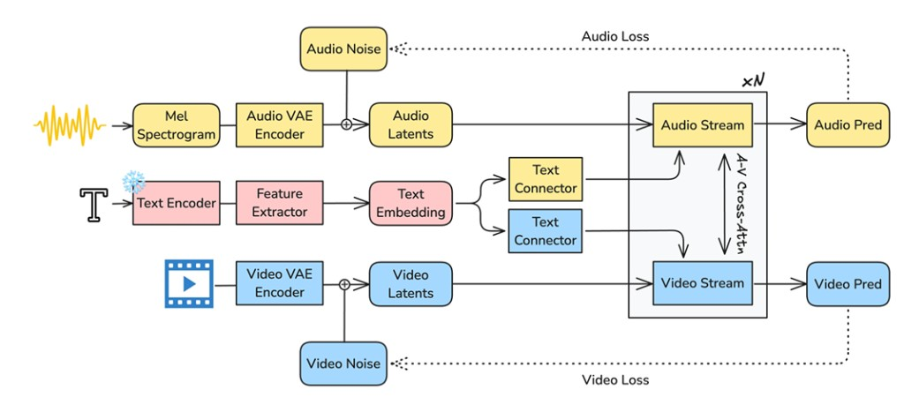
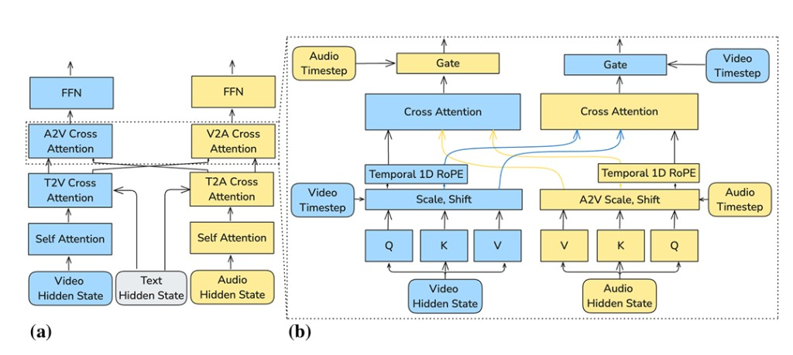
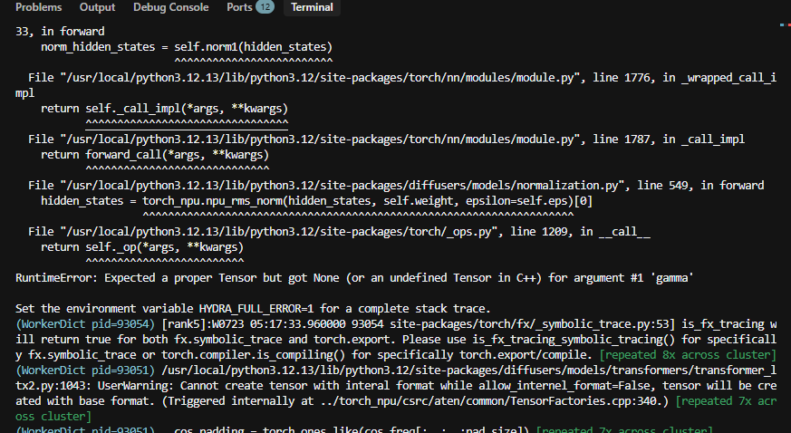
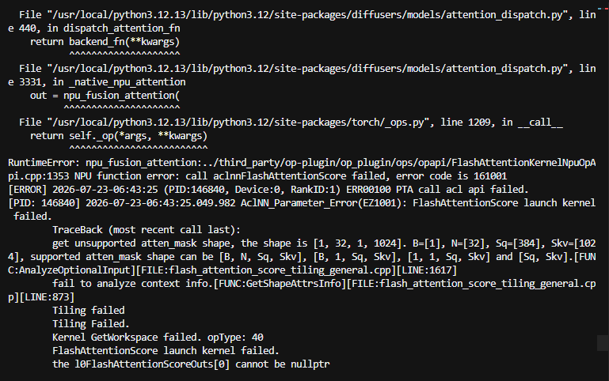
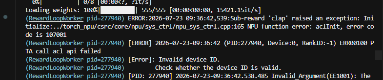
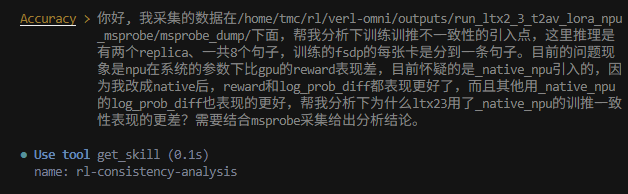
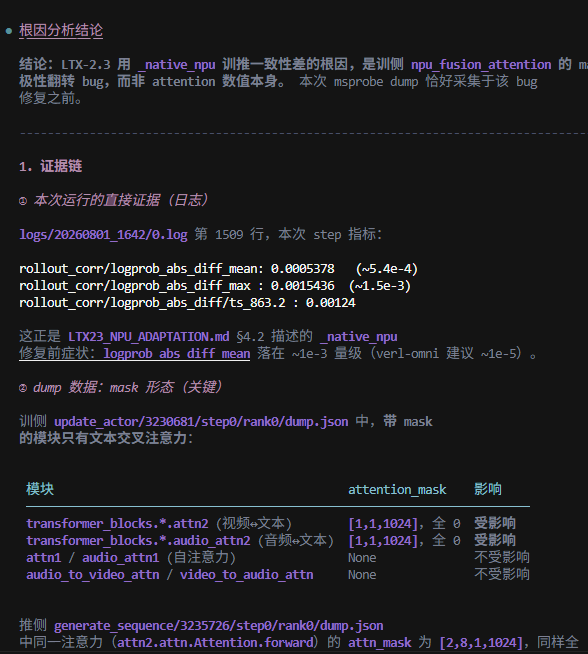

# 训战任务 1：LTX-2.3 适配记录

本文记录 LTX-2.3 在 verl-omni 中进行文本生成音视频（T2AV）FlowGRPO 训练的适配过程，重点包括模型结构、GPU/NPU 整网打通、奖励调试和训推一致性对齐。

## 1. 任务概述

### 1.1 任务目标

本任务以 `dg845/LTX-2.3-Diffusers` 为策略模型，在 verl-omni 中完成 T2AV LoRA 强化学习训练。

训练采用 FlowGRPO 算法：

- vLLM-Omni 负责轨迹采样（rollout）。
- 基于 Diffusers 的 FSDP Actor 在指定 SDE 转移步上重算对数概率，并更新 LoRA 参数。
- CLAP 评估文本与音频的对齐程度，ImageBind 评估音频与视频的对齐程度。

具体目标如下：

1. 在 GPU 和 NPU 上跑通端到端训练。
2. 确保奖励曲线整体上升。
3. 完成 Ascend NPU 与同配置 GPU 的精度对齐。
4. 完成 NPU 性能调优。

### 1.2 实施阶段

整体工作分为五个阶段：


### 1.3 环境与依赖

verl-omni 侧的 LTX-2.3 T2AV FlowGRPO 适配已整理为 [verl-project/verl-omni#278](https://github.com/verl-project/verl-omni/pull/278)。

NPU 实验环境基于仓库中的 Atlas A2 镜像配方 `docker/Dockerfile.a2.npu` 构建，基础镜像为 `quay.io/ascend/cann:9.0.0-910b-ubuntu22.04-py3.12`。

| 组件 | 版本 |
| --- | --- |
| CANN | 9.0.0 |
| PyTorch / torch_npu | 2.10.0 |
| Ray | 实际安装 2.48.0 |
| Diffusers | >= 0.37.1 |
| verl | `8a69493`（见 `.github/verl_pin.txt`） |
| vLLM | 0.24.0 |
| vLLM-Omni | `.github/vllm_omni_pin.txt` 对应提交 |

使用的模型和数据如下：

| 类型 | 来源 |
| --- | --- |
| 策略模型 | [dg845/LTX-2.3-Diffusers](https://huggingface.co/dg845/LTX-2.3-Diffusers) |
| CLAP 权重 | [laion/larger_clap_general](https://huggingface.co/laion/larger_clap_general) |
| 提示词数据 | [Flow-Factory `dataset/vid_prompt`](https://github.com/X-GenGroup/Flow-Factory/tree/main/dataset/vid_prompt) |

提示词数据经 `prepare_data.py` 转换为 Parquet 格式后用于训练。

## 2. LTX-2.3 模型结构

### 2.1 整体架构

LTX-2.3 是面向文本条件联合音视频生成的开源基础模型，沿用 LTX-2 的非对称双流扩散 Transformer（DiT）架构。

不同于“先生成视频，再补充音频”的串行流程，LTX-2.3 在同一去噪过程中同时建模音频和视频，并通过双向交叉注意力显式交换跨模态信息，从而生成时间对齐的音视频内容。

根据官方 ltx-core 说明：

- 视频流约 14B 参数，侧重时空动态，使用 3D RoPE。
- 音频流约 5B 参数，侧重一维时间结构，使用 1D RoPE。
- 两路网络包含 48 个 Transformer 块，但隐藏层宽度不同，以适应不同模态的信息密度。
- 块内使用跨模态 AdaLN，使一侧的缩放和门控受另一侧隐状态及扩散时间步调节。

该结构允许音频和视频在分辨率或时间步不完全一致时仍保持同步。

### 2.2 数据流

整体数据流如下：

1. 音频波形经过 Mel 频谱转换和 Audio VAE 编码，得到音频 latent。
2. 视频像素经过 Video VAE 编码，得到视频 latent。
3. 训练时，两路 latent 分别加入噪声后进入双流 Transformer。
4. 文本经过冻结的 Text Encoder 和多层 Feature Extractor，得到语义特征。
5. 文本特征通过音频、视频各自的 Text Connector 注入两路网络。
6. Transformer 对音频和视频 latent 进行联合去噪，输出 Audio Pred 和 Video Pred。
7. 推理时，去噪后的 latent 由对应 VAE 解码；音频侧再通过 vocoder 还原为波形。



*图 1：文本条件联合音视频扩散的数据流。黄色表示音频，蓝色表示视频，红色表示文本。*

### 2.3 Transformer 块

每个 Transformer 块按以下顺序处理：

1. 视频和音频隐状态分别经过 Self-Attention，聚合各自模态内的上下文。
2. 两路隐状态分别通过 T2V、T2A 文本交叉注意力接收文本条件。
3. 通过 A2V、V2A 双向交叉注意力交换音视频信息。
4. 通过 FFN 完成特征变换。

在音视频交叉注意力中，两路隐状态分别投影为 Q、K、V，并经过本模态时间步控制的 Scale/Shift 和 Temporal 1D RoPE：

- Query 来自当前模态。
- Key 和 Value 来自另一模态。
- 输出由包含对侧时间步信息的 Gate 调制。

视频自注意力额外使用 3D RoPE 编码空间和时间位置。音频与视频因此可以在整个去噪过程中持续交换信息，使唇形、拟音和场景声等细粒度内容保持同步。



*图 2：(a) 双流 Transformer 块的算子顺序；(b) 带有 timestep 条件的音视频交叉注意力。*

## 3. GPU/NPU 整网打通

GPU 端到端训练跑通后，NPU 训练主要遇到三个阻塞问题。

| 问题 | 直接原因 | 处理方式 |
| --- | --- | --- |
| RMSNorm 报错 | `npu_rms_norm` 不接受空 `gamma` | 无权重时回退到 PyTorch 实现 |
| FA mask 形状不兼容 | NPU 内核不广播 query 维 | 显式扩展到目标形状 |
| Reward Worker 无法加载 NPU | Ray 写入空的设备可见列表 | 升级 Ray 或显式分配设备 |

前两个问题属于 Diffusers Ascend 路径与 LTX 约定不兼容，相关修复已合入 [diffusers#14288](https://github.com/huggingface/diffusers/pull/14288)。第三个问题与 Ray 对 NPU 可见设备的处理有关。

### 3.1 RMSNorm 无权重问题

**现象**

Actor 重算 `old_log_probs` 时进入 `RMSNorm.forward`，调用 `torch_npu.npu_rms_norm` 报错，提示 `gamma`（即 `self.weight`）为 `None`。



**原因**

LTX 部分归一化层设置了 `elementwise_affine=False`，因此没有可学习的 `weight`。GPU 和纯 PyTorch 路径允许 `weight is None`，但 `npu_rms_norm` 要求传入有效的 `gamma`。

**处理**

仅当 `self.weight is not None` 时使用 NPU 融合算子；否则回退到现有 PyTorch 实现。该方案与 CUDA 路径的数学定义一致。

不应通过设置 `elementwise_affine=True` 强行增加权重，否则会改变预训练模型结构，并造成 GPU/NPU 配方不一致。

### 3.2 FA mask 形状不兼容

**现象**

启用 `_native_npu` 后，交叉注意力中的 `npu_fusion_attention` 执行失败。当前 `atten_mask` 的形状为 `[1, 32, 1, 1024]`，查询长度为 `Sq = 384`。



**原因**

LTX 交叉注意力将 encoder 侧 mask 整理为 `[B, N, 1, Skv]`。CUDA SDPA 可以自动广播 query 维，但 Ascend 融合注意力要求 query 维与 `Sq` 显式对齐，仅支持以下形状：

- `[B, N, Sq, Skv]`
- `[B, 1, Sq, Skv]`
- `[1, 1, Sq, Skv]`
- `[Sq, Skv]`

**处理**

在 `_maybe_modify_attn_mask_npu` 中，对满足以下条件的 mask 进行扩展：

- mask 为 4 维。
- query 维为 `1`。
- 最后一维等于 `Skv`。

最终将 mask 扩展为 `[B, N|1, Sq, Skv]`，覆盖 LTX 常见的 `[B, N, 1, Skv]` 输入。

> 该修复只解决 mask 形状与 NPU 内核不兼容的问题。加性掩码的语义问题见第 4 节。

### 3.3 Ray 设备可见性问题

**现象**

模型前向跑通后，`RewardLoopWorker` 加载 CLAP 奖励模型时调用 `aclInit` 失败，报错为 `Invalid device ID`。



**原因**

Ray 使用 `ASCEND_RT_VISIBLE_DEVICES` 控制进程可见的 NPU。部分 Ray 版本会将加速器数量为 0 的 Actor 对应变量写为空字符串，导致后续任意 `.to("npu")` 调用失败。

**处理**

- 将 Ray 升级到已修复该问题的版本。本环境实际使用 2.48.0。
- 必要时为 Reward Worker 显式申请 NPU，或暂时将奖励计算放到 CPU。
- NPU 路径中的 DataProto 通过 Ray 传输时，设置 `VERL_DATAPROTO_SERIALIZATION_METHOD=numpy`。

## 4. 奖励调试与训推一致性对齐

本阶段按两个步骤推进：首先提高 GPU 训练的调试效率，确认奖励能够正常上涨；GPU 基线稳定后，再对比 NPU 结果并排查训推一致性问题。

### 4.1 Reward 调试

GPU 训练跑通后，需要先验证 CLAP 和 ImageBind Reward 能否正常上涨，并将结果作为 NPU 精度对齐的基线。

初始脚本直接从原仓库迁移：Rollout TP 为 8，仅启动 1 个 replica；`log_prob_micro_batch_size_per_gpu` 等参数为 1，需要执行多轮 micro batch 计算，导致单个 step 耗时约 50 分钟。

参考 verl 的 [性能调优指南](https://github.com/verl-project/verl/blob/main/docs/perf/perf_tuning.rst)，在显存允许的范围内调整关键参数：

| 配置项 | 调整前 | 调整后 |
| --- | ---: | ---: |
| Rollout TP | 8 | 根据 4 个 replica 重新配置 |
| Rollout replica 数量 | 1 | 4 |
| `log_prob_micro_batch_size_per_gpu` 相关参数 | 1 | 24 |
| 单个 step 耗时 | 约 50 分钟 | 约 15 分钟 |

调整后，单步耗时降至约 15 分钟，调试效率提升约 3.3 倍，GPU 前 10 个 step 的 Reward 稳定上涨。受 GPU 资源限制，100 step 长稳训练仍在验证中。

目前参数调整主要依赖人工经验，增大 replica 或 micro batch 时容易触发 OOM。后续计划基于 msagent 开发参数寻优 Skill，在给定设备和显存约束下自动筛选配置，快速生成可用于 Reward 调试的性能配方。

### 4.2 训推一致性排查

NPU 使用 `_native_npu` 时 Reward 低于 GPU、震荡更大，`logprob_abs_diff_mean` 约 `1e-3`。训练侧改为 `native`（SDPA）后，Reward 与 GPU 对齐，`logprob_abs_diff_mean` 约 `1e-5`，问题指向 `_native_npu`。

| Attention 后端 | `logprob_abs_diff_mean` | Reward |
| --- | --- | --- |
| `_native_npu` | 约 `1e-3` | 低于 GPU，震荡更大 |
| `native` | 约 `1e-5` | 与 GPU 基本对齐 |

#### 4.2.1 数据采集

参考 msprobe [异步架构 verl 训推一致性比对数据采集](https://gitcode.com/Ascend/msprobe/blob/master/docs/zh/user_guide/dump/verl_async_consistency_preprocess_dump.md)，在 generate / `log_prob` 两侧接入 `PrecisionDebugger`。改动文件：

| 文件 | 说明 |
| --- | --- |
| `verl_omni/utils/msprobe_dump.py` | dump 辅助（`DUMP_ON` / `DUMP_PHASE`、debugger、pid 隔离） |
| `verl_omni/pipelines/ltx2_flow_grpo/vllm_omni_rollout_adapter.py` | rollout 侧 `start/stop/step` |
| `verl_omni/workers/engine/fsdp/diffusers_impl.py` | actor `log_prob` / `update_actor` 侧 dump |
| `examples/flowgrpo_trainer/ltx2/msprobe/config_{actor,generate}.json` | 两侧 L0 + statistics 配置 |
| `examples/flowgrpo_trainer/ltx2/run_ltx2_3_t2av_lora_npu_msprobe.sh` | 采集启动脚本 |

#### 4.2.2 MindStudio Agent 自动分析

MindStudio Agent **v26.0.0.alpha1**，模型 **DeepSeek V4 Flash**，进入 **Accuracy** 子代理（`rl-consistency-analysis`）。





**结论：** dump 显示训推两侧 `attn2` mask 均为全零 additive（约 `[1,1,1024]`）。SDPA 视其为全 attend；原 NPU 路径按 keep-mask 取反后变成全屏蔽。问题代码：

```python
# 原实现：一律按 keep-mask 取反
if attn_mask is not None and torch.all(attn_mask != 0):
    attn_mask = None
# ... reshape ...
attn_mask = ~attn_mask.to(torch.bool)  # 全零 additive → 全 True → NPU 全部屏蔽
```

Qwen-Image 用 keep-mask，全 1 时常变 `None`，故同类 `_native_npu` 下 `logprob_abs_diff` 仍约 `1e-5`。

#### 4.2.3 修改验证

在 `_maybe_modify_attn_mask_npu` 中区分 additive / keep-mask：

```python
is_additive = attn_mask.dtype != torch.bool and (
    torch.any(attn_mask < -1)
    or (attn_mask.is_floating_point() and torch.all(attn_mask == 0))
)

if is_additive:
    if not torch.any(attn_mask < -1):
        return None                      # 全零 → 全 attend
    block_mask = attn_mask < 0           # 负值 = discard，不再取反
else:
    if torch.all(attn_mask != 0):
        return None
    block_mask = ~attn_mask.to(torch.bool)
# ... 再按需 expand 到 [B, N|1, Sq, Skv] ...
return block_mask
```

复测后 `_native_npu` 的 `logprob_abs_diff_mean` 约 `1e-5`，Reward 与 GPU 对齐。

## 5. 性能优化

待进行

## 参考文献

1. Yoav HaCohen, et al. *LTX-2: Efficient Joint Audio-Visual Foundation Model*. arXiv:2601.03233, 2025. <https://arxiv.org/abs/2601.03233>
2. Ascend. *msProbe：异步架构 verl 训推一致性比对数据采集*. <https://gitcode.com/Ascend/msprobe/blob/master/docs/zh/user_guide/dump/verl_async_consistency_preprocess_dump.md>
3. Ascend. *msProbe：PyTorch 场景精度数据采集*. <https://gitcode.com/Ascend/msprobe/blob/master/docs/zh/user_guide/dump/pytorch_data_dump_instruct.md>
